## Overview

The AI Video Presentation Generator is a full-stack application that transforms text prompts into complete video presentations with voice narration, visual slides, and animations. The system uses a modern web architecture with React frontend and FastAPI backend, integrated with multiple AI services.

## High-Level Architecture

```mermaid
graph TB
    User[User Browser] --> Frontend[React + Vite Frontend]
    Frontend --> API[FastAPI Backend]
    
    API --> Gemini[Google Gemini API]
    API --> Sarvam[Sarvam TTS API]
    API --> Unsplash[Unsplash API]
    API --> Manim[Manim Renderer]
    API --> FFmpeg[FFmpeg]
    
    API --> Storage[(File Storage)]
    
    Gemini -->|Content & Scripts| API
    Sarvam -->|Voice Audio| API
    Unsplash -->|Images| API
    Manim -->|Animations| API
    FFmpeg -->|Video Composition| API
    
    Storage -->|Outputs| User
    
    style Frontend fill:#61dafb
    style API fill:#009688
    style Gemini fill:#4285f4
    style Sarvam fill:#ff9800
    style Unsplash fill:#111111
```



## Technology Stack

### Frontend
- **Framework**: React 18 with Vite
- **Styling**: TailwindCSS for modern UI components
- **State Management**: React Hooks (useState, useEffect)
- **Real-time Updates**: Server-Sent Events (SSE)
- **HTTP Client**: Axios

### Backend
- **Framework**: FastAPI (Python)
- **API Type**: REST with SSE support
- **Video Processing**: MoviePy, FFmpeg
- **Animation**: Manim Community Edition
- **Image Processing**: Pillow (PIL)
- **AI Integration**: Google Gemini, Sarvam AI

### External Services

<CardGroup cols={2}>
  <Card title="Google Gemini" icon="brain">
    Generates structured presentation content and voice narration scripts
  </Card>
  
  <Card title="Sarvam AI" icon="microphone">
    Multi-language text-to-speech for voice narration (English, Hindi, Kannada, Telugu)
  </Card>
  
  <Card title="Unsplash API" icon="image">
    Fetches relevant images based on content keywords
  </Card>
  
  <Card title="Manim" icon="play">
    Generates mathematical and scientific animations for complex concepts
  </Card>
</CardGroup>

## Directory Structure

```
AI-VIDEO-GEN/
├── backend/
│   ├── generators/              # Content generation modules
│   │   ├── content_generator.py # Gemini: PPT structure
│   │   ├── script_generator.py  # Gemini: Voice scripts
│   │   ├── voice_generator.py   # Sarvam: TTS
│   │   ├── image_fetcher.py     # Unsplash integration
│   │   └── manim_generator.py   # Animation code gen
│   │
│   ├── utils/                   # Video processing utilities
│   │   ├── slide_renderer.py    # PIL: Text slides → PNG
│   │   ├── video_renderer.py    # Manim → MP4
│   │   └── video_composer.py    # MoviePy: Final assembly
│   │
│   ├── outputs/                 # Generated files
│   │   ├── audio/              # Voice narration (MP3)
│   │   ├── images/             # Downloaded images
│   │   ├── manim_code/         # Generated Python code
│   │   ├── manim_output/       # Rendered animations
│   │   ├── scripts/            # JSON scripts
│   │   ├── slides/             # Slide images (PNG)
│   │   └── final/              # Final videos (MP4)
│   │
│   ├── app.py                  # FastAPI application
│   ├── config.py               # Configuration
│   └── requirements.txt        # Python dependencies
│
├── frontend/
│   ├── src/
│   │   ├── components/
│   │   │   ├── Home.jsx        # Input form
│   │   │   ├── StepProgress.jsx # Progress tracker
│   │   │   ├── VideoPlayer.jsx # Video playback
│   │   │   ├── SlideEditor.jsx # Slide preview
│   │   │   └── SlidePreview.jsx
│   │   │
│   │   ├── hooks/
│   │   │   └── useSSEProgress.jsx # SSE handler
│   │   │
│   │   ├── utils/
│   │   │   ├── api.js          # API client
│   │   │   └── pptExport.js   # PPT export
│   │   │
│   │   ├── App.jsx             # Main app component
│   │   └── main.jsx            # Entry point
│   │
│   ├── package.json
│   └── vite.config.js
│
└── README.md
```

## Data Flow: Topic → Video

<Steps>
  <Step title="User Input">
    User enters topic, number of slides, language, and tone in React frontend
  </Step>
  
  <Step title="Content Generation">
    Backend calls Gemini API to generate structured presentation content with slide metadata
  </Step>
  
  <Step title="Script Generation">
    Gemini creates voice narration scripts with timing for each slide
  </Step>
  
  <Step title="Audio Generation">
    Sarvam TTS generates voice audio per slide, actual durations replace estimates
  </Step>
  
  <Step title="Visual Generation">
    For each slide (mutually exclusive):
    - **Text-only**: Rendered with Pillow (PNG)
    - **With Image**: Unsplash fetch + composite with text
    - **With Animation**: Manim generates code → renders MP4 → composites with base slide
  </Step>
  
  <Step title="Audio Combining">
    All slide audio files concatenated into single MP3 track
  </Step>
  
  <Step title="Video Composition">
    MoviePy combines slide visuals with synchronized audio into final MP4
  </Step>
  
  <Step title="Delivery">
    Video streamed to frontend with range request support for smooth playback
  </Step>
</Steps>

## Communication Patterns

### REST API Endpoints

| Endpoint | Method | Purpose |
|----------|--------|----------|
| `/api/generate` | POST | Start video generation |
| `/api/progress/{id}` | GET (SSE) | Real-time progress updates |
| `/api/video/{filename}` | GET | Stream final video |
| `/api/status/{id}` | GET | Check generation status |
| `/health` | GET | Health check |

### Server-Sent Events (SSE)

The system uses SSE for real-time progress tracking:

```javascript
// Frontend hook
const eventSource = new EventSource(
  `http://localhost:8000/api/progress/${generationId}`
);

eventSource.onmessage = (event) => {
  const data = JSON.parse(event.data);
  // Update progress UI: data.progress, data.status, data.message
};
```

```python
# Backend generator
async def event_generator():
    while not_complete:
        yield f"data: {json.dumps(status_data)}\n\n"
        await asyncio.sleep(0.5)
```

## Design Principles

<AccordionGroup>
  <Accordion title="Modular Generator Pattern">
    Each content type (scripts, audio, images, animations) has dedicated generator class with single responsibility
  </Accordion>
  
  <Accordion title="Mutual Exclusivity">
    Slides can have EITHER animation OR image, never both - enforced by validation
  </Accordion>
  
  <Accordion title="Real-time Feedback">
    SSE provides continuous progress updates without polling, improving UX
  </Accordion>
  
  <Accordion title="File-based Storage">
    All intermediate outputs saved to disk for debugging, caching, and recovery
  </Accordion>
  
  <Accordion title="Async Processing">
    Long-running generation happens in background while UI remains responsive
  </Accordion>
</AccordionGroup>

## Performance Characteristics

- **Generation Time**: 2-5 minutes for 5-slide video
- **Video Resolution**: 1920x1080 (Full HD)
- **Frame Rate**: 30 FPS
- **Audio Quality**: 192 kbps AAC
- **Video Bitrate**: 5000 kbps

## Security Considerations

<Warning>
  All API keys (Gemini, Sarvam, Unsplash) are stored in `.env` file and loaded via `config.py`. Never commit `.env` to version control.
</Warning>

<Note>
  CORS is configured for `localhost:5173` (Vite dev server). Update for production deployment.
</Note>

## Next Steps

<CardGroup cols={2}>
  <Card title="Frontend Architecture" icon="react" href="/development/frontend">
    Dive into React components and state management
  </Card>
  
  <Card title="Backend Architecture" icon="server" href="/development/backend">
    Explore FastAPI structure and generator pattern
  </Card>
  
  <Card title="Pipeline Flow" icon="diagram-project" href="/development/pipeline">
    Understand the complete generation pipeline
  </Card>
  
  <Card title="Installation" icon="download" href="/installation">
    Set up your development environment
  </Card>
</CardGroup>