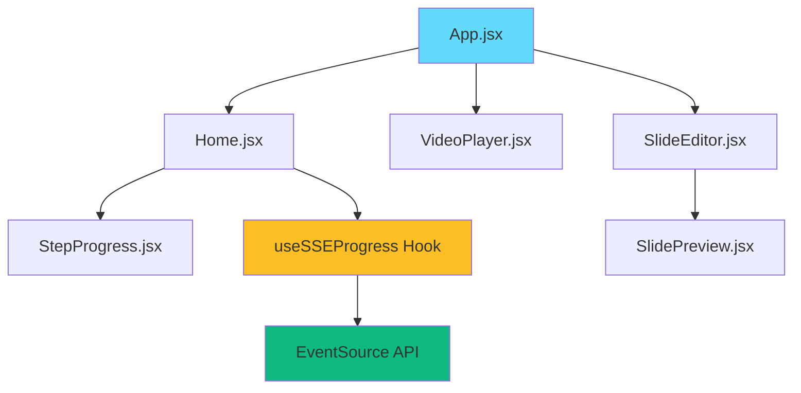
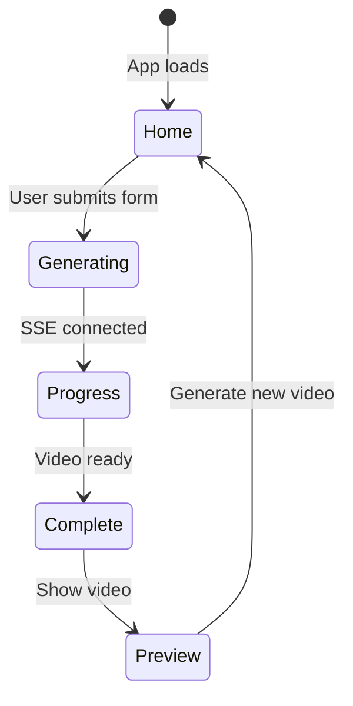
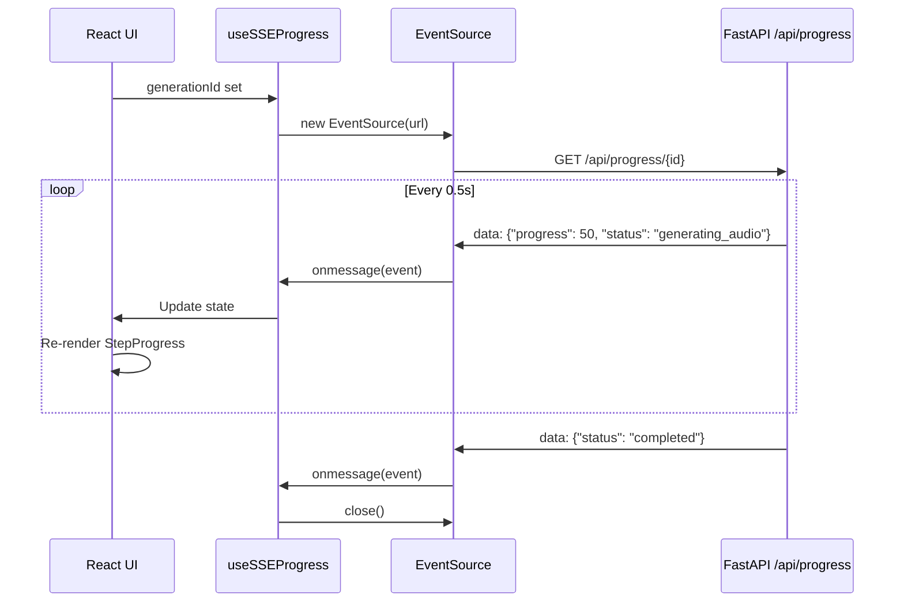

## Overview

The frontend is a single-page application built with **React 18** and **Vite**, featuring real-time progress tracking through Server-Sent Events (SSE) and a responsive UI powered by TailwindCSS.

## Tech Stack

<CardGroup cols={2}>
  <Card title="React 18" icon="react">
    Modern React with Hooks for component logic
  </Card>
  
  <Card title="Vite" icon="bolt">
    Lightning-fast dev server and build tool
  </Card>
  
  <Card title="TailwindCSS" icon="css3">
    Utility-first styling with custom gradients
  </Card>
  
  <Card title="Axios" icon="network-wired">
    Promise-based HTTP client for API calls
  </Card>
</CardGroup>

## Component Hierarchy



## Key Components

### App.jsx

**Purpose**: Root component managing application state and routing between views

**State Management**:
```javascript
const [view, setView] = useState('home'); // 'home' | 'preview'
const [generatedData, setGeneratedData] = useState(null);
```

**Responsibilities**:
- Switch between Home (input form) and Preview (video player) views
- Store generated presentation data
- Pass callbacks to child components

**Code Location**: `frontend/src/App.jsx`

---

### Home.jsx

**Purpose**: Input form for video generation with real-time progress tracking

**State Variables**:
```javascript
const [topic, setTopic] = useState("");
const [numSlides, setNumSlides] = useState(5);
const [language, setLanguage] = useState("english");
const [tone, setTone] = useState("formal");
const [loading, setLoading] = useState(false);
const [error, setError] = useState("");
const [generationId, setGenerationId] = useState(null);
```

**Key Features**:

<AccordionGroup>
  <Accordion title="Form Inputs">
    - **Topic**: Text input with Enter key support
    - **Number of Slides**: Range 3-10
    - **Language**: Select (English, Hindi, Kannada, Telugu)
    - **Tone**: Select (Formal, Casual, Enthusiastic)
  </Accordion>
  
  <Accordion title="Progress Tracking">
    Uses `useSSEProgress` hook to display real-time generation status via `StepProgress` component
  </Accordion>
  
  <Accordion title="Generation Flow">
    1. Sanitize topic for ID generation
    2. Trigger SSE connection
    3. Call `/api/generate` endpoint
    4. Display progress
    5. On completion, call `onGenerationComplete(data)`
  </Accordion>
</AccordionGroup>

**Code Location**: `frontend/src/components/Home.jsx:733-1060`

---

### StepProgress.jsx

**Purpose**: Visual progress tracker displaying pipeline stages

**Props**:
```javascript
{
  status: string,      // Current pipeline stage
  progress: number,    // 0-100 percentage
  message: string,     // Current status message
  isConnected: boolean // SSE connection status
}
```

**Pipeline Steps**:
```javascript
const STEPS = [
  { id: 'started', label: 'Initializing', icon: '🚀' },
  { id: 'generating_content', label: 'Generating Content', icon: '📝' },
  { id: 'generating_scripts', label: 'Creating Scripts', icon: '📜' },
  { id: 'generating_audio', label: 'Generating Audio', icon: '🎤' },
  { id: 'combining_audio', label: 'Combining Audio', icon: '🎵' },
  { id: 'generating_media', label: 'Creating Visuals', icon: '🎨' },
  { id: 'generating_animation', label: 'Rendering Animation', icon: '🎬' },
  { id: 'fetching_image', label: 'Fetching Images', icon: '🖼️' },
  { id: 'generating_slide', label: 'Creating Slides', icon: '📄' },
  { id: 'composing_video', label: 'Composing Video', icon: '🎞️' },
  { id: 'completed', label: 'Complete', icon: '✅' },
];
```

**Visual Features**:
- Color-coded step indicators (gray → blue → green)
- Animated progress bar with gradient
- Connection status indicator
- Current message display
- Completed/Active/Pending states

**Code Location**: `frontend/src/components/StepProgress.jsx:1-241`

---

### VideoPlayer.jsx

**Purpose**: Video playback with slide timeline navigation

**Key Features**:
- HTML5 `<video>` element with custom controls
- Timeline with slide markers
- Slide navigation buttons
- Current slide highlight
- Video download option

**Code Location**: `frontend/src/components/VideoPlayer.jsx`

---

### SlideEditor.jsx

**Purpose**: Slide-by-slide preview and editing interface

**Features**:
- Slide carousel navigation
- Individual slide preview
- Export to PowerPoint (via `pptExport.js`)
- Slide metadata display

**Code Location**: `frontend/src/components/SlideEditor.jsx`

---

## State Management

The application uses **React Hooks** for state management - no Redux or external state libraries needed due to simple data flow.

### State Flow Pattern



### Prop Drilling Pattern

```javascript
// App.jsx passes callbacks down
<Home onGenerationComplete={(data) => {
  setGeneratedData(data);
  setView('preview');
}} />

// Home.jsx calls callback on success
if (response.data.status === "success") {
  onGenerationComplete({
    content: response.data.content_data,
    script: response.data.script_data,
    videoPath: response.data.video_path,
    videoFilename: response.data.video_filename,
    generationId: genId
  });
}
```

## Custom Hooks

### useSSEProgress

**Purpose**: Manage Server-Sent Events connection for real-time progress

**Location**: `frontend/src/hooks/useSSEProgress.jsx`

**Usage**:
```javascript
const { 
  progress,      // Current progress (0-100)
  status,        // Pipeline stage ID
  message,       // Human-readable message
  logs,          // Array of log entries
  isConnected,   // Connection status
  clearLogs,     // Reset logs function
  disconnect     // Close SSE connection
} = useSSEProgress(generationId, autoConnect);
```

**Implementation Details**:

<Steps>
  <Step title="Connection Setup">
    Creates `EventSource` to `/api/progress/{generationId}` endpoint
  </Step>
  
  <Step title="Message Handling">
    Parses JSON data and updates state on each message
  </Step>
  
  <Step title="Duplicate Prevention">
    Checks last log message to avoid duplicate entries
  </Step>
  
  <Step title="Auto-disconnect">
    Closes connection on `completed`, `error`, or `done` status
  </Step>
  
  <Step title="Cleanup">
    Closes EventSource on component unmount
  </Step>
</Steps>

**Key Code**:
```javascript
eventSource.onmessage = (event) => {
  const data = JSON.parse(event.data);
  
  setProgress(data.progress || 0);
  setStatus(data.status || 'processing');
  setMessage(data.message || '');
  
  // Add to logs (skip duplicates)
  setLogs((prev) => {
    const lastLog = prev[prev.length - 1];
    if (lastLog && lastLog.message === data.message) {
      return prev;
    }
    return [...prev, {
      timestamp: data.timestamp,
      message: data.message,
      progress: data.progress,
      status: data.status
    }];
  });
  
  // Close on completion
  if (data.status === 'completed' || data.status === 'error') {
    eventSource.close();
  }
};
```

## API Integration

### API Client: utils/api.js

**Location**: `frontend/src/utils/api.js`

**Configuration**:
```javascript
import axios from "axios";

const API_BASE_URL = "http://localhost:8000";

export const generateSlides = async ({
  topic, 
  slideCount, 
  contentStyle, 
  includeImages
}) => {
  const res = await axios.post(
    `${API_BASE_URL}/api/generate`,
    { topic, slideCount, contentStyle, includeImages },
    { 
      timeout: 60000,
      headers: { 'Content-Type': 'application/json' }
    }
  );
  
  if (!res.data || !res.data.slides) {
    throw new Error("Invalid response format");
  }
  
  return res.data.slides;
};
```

**Error Handling**:
- Server errors: Display error message from response
- Network errors: Show "backend not running" message
- Timeout errors: 60-second timeout with clear feedback

## Real-time Progress with SSE

### Why SSE over WebSockets?

<CardGroup cols={2}>
  <Card title="Advantages" icon="check">
    - Built-in browser API (EventSource)
    - Automatic reconnection
    - Simpler server implementation
    - One-way communication sufficient
  </Card>
  
  <Card title="Trade-offs" icon="info">
    - No bidirectional communication
    - Text-based only (JSON)
    - Limited browser support (IE)
  </Card>
</CardGroup>

### SSE Flow Diagram



## Styling Approach

### TailwindCSS Utilities

**Gradient Backgrounds**:
```jsx
<div className="bg-gradient-to-br from-purple-50 via-blue-50 to-indigo-100">
```

**Responsive Grid**:
```jsx
<div className="grid grid-cols-1 md:grid-cols-3 gap-4">
```

**Animations**:
```jsx
<div className="animate-pulse">Loading...</div>
<svg className="animate-spin h-5 w-5">...</svg>
```

**Custom Theme**: `frontend/src/styles/theme.css`

## Performance Optimizations

<AccordionGroup>
  <Accordion title="Component Memoization">
    Use React.memo for expensive renders (not currently needed due to simple structure)
  </Accordion>
  
  <Accordion title="Event Throttling">
    SSE messages throttled to 0.5s intervals to prevent UI overload
  </Accordion>
  
  <Accordion title="Lazy Loading">
    Video player loads on-demand in preview view
  </Accordion>
  
  <Accordion title="Video Streaming">
    Range request support allows video seeking without full download
  </Accordion>
</AccordionGroup>

## Development Workflow

```bash
# Install dependencies
cd frontend
npm install

# Start dev server (with hot reload)
npm run dev
# → http://localhost:5173

# Build for production
npm run build

# Preview production build
npm run preview
```

## Next Steps

<CardGroup cols={2}>
  <Card title="Backend Architecture" icon="server" href="/development/backend">
    Learn about FastAPI structure and generators
  </Card>
  
  <Card title="Pipeline Flow" icon="diagram-project" href="/development/pipeline">
    Understand the complete generation process
  </Card>
  
  <Card title="Dependencies" icon="palette" href="/development/dependencies">
    Frontend dependencies and versions
  </Card>
</CardGroup>