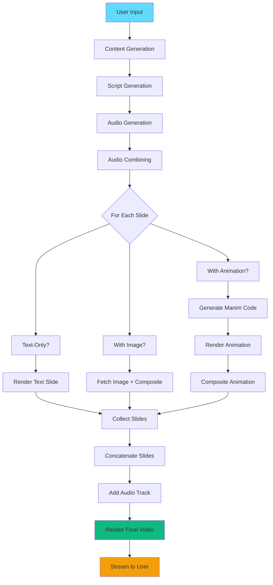

## Pipeline Overview

The video generation pipeline consists of **11 stages** that transform a text prompt into a complete video presentation with synchronized audio and visuals.



## Pipeline Stages

### Stage 1: Initialization (0-10%)

**Duration**: ~1 second

**Location**: `backend/app.py:223-237`

**Tasks**:
1. Receive POST request with topic, num_slides, language, tone
2. Sanitize topic for file naming
3. Create generation ID
4. Initialize progress tracking

**Code**:
```python
topic_clean = topic[:30].replace(' ', '_').replace(':', '').replace('/', '_')
topic_clean = topic_clean.replace('"', '').replace("'", '').replace('?', '').replace('!', '')

generation_id = topic_clean
update_progress(generation_id, 0, "started", "🚀 Starting generation...")
```

**Output**: None (metadata only)

---

### Stage 2: Content Generation (10-20%)

**Duration**: 10-30 seconds

**Location**: `backend/app.py:240-243`

**Generator**: `ContentGenerator` (content_generator.py)

**Process**:

<Steps>
  <Step title="Build Prompt">
    Create detailed prompt with requirements for slide structure, mutual exclusivity rules, and content guidelines
  </Step>
  
  <Step title="Call Gemini API">
    Send prompt to Gemini with `response_mime_type="application/json"`
  </Step>
  
  <Step title="Parse Response">
    Clean JSON markers (```json, ```) and parse response
  </Step>
  
  <Step title="Validate Structure">
    - Check all required fields present
    - Enforce mutual exclusivity (animation XOR image)
    - Add missing fields with defaults
  </Step>
  
  <Step title="Save Content">
    Write to `outputs/slides/{topic}_content.json`
  </Step>
</Steps>

**Output Structure**:
```json
{
  "topic": "Newton's Third Law of Motion",
  "total_slides": 5,
  "slides": [
    {
      "slide_number": 1,
      "title": "Newton's Third Law",
      "content_text": "For every action, there is an equal and opposite reaction",
      "needs_image": false,
      "image_keyword": "",
      "needs_animation": true,
      "animation_description": "Show rocket with force vectors",
      "duration": 6.0
    }
  ]
}
```

**Error Handling**:
```python
try:
    content_data = content_gen.generate_content(topic, num_slides)
except Exception as e:
    print(f"Content generation error: {e}")
    traceback.print_exc()
    raise
```

---

### Stage 3: Script Generation (20-30%)

**Duration**: 10-20 seconds

**Location**: `backend/app.py:246-249`

**Generator**: `ScriptGenerator` (script_generator.py)

**Process**:

<Steps>
  <Step title="Prepare Slide Info">
    Extract title, content, duration, and visual flags for each slide
  </Step>
  
  <Step title="Build Context Prompt">
    Include language, tone instructions, and special handling for animations
  </Step>
  
  <Step title="Generate Scripts">
    Call Gemini to create natural narration text for each slide
  </Step>
  
  <Step title="Estimate Timestamps">
    Calculate cumulative start/end times based on slide durations (will be corrected later)
  </Step>
</Steps>

**Special Cases**:

<AccordionGroup>
  <Accordion title="Animation Slides">
    Narration includes visual descriptions:
    - "As you can see on screen..."
    - "Watch as the rocket..."
    - "Notice how the force vectors..."
  </Accordion>
  
  <Accordion title="Image Slides">
    Natural image references:
    - "Looking at this image..."
    - "This diagram shows..."
  </Accordion>
  
  <Accordion title="Text Slides">
    Pure conceptual explanation without visual references
  </Accordion>
</AccordionGroup>

**Output Structure**:
```json
{
  "topic": "Newton's Third Law of Motion",
  "total_duration": 30.0,
  "language": "english",
  "slide_scripts": [
    {
      "slide_number": 1,
      "start_time": 0.0,
      "end_time": 6.0,
      "narration_text": "Today we'll explore Newton's Third Law, which states that for every action, there is an equal and opposite reaction."
    }
  ]
}
```

---

### Stage 4: Audio Generation (30-48%)

**Duration**: 30-60 seconds (depends on slide count)

**Location**: `backend/app.py:252-303`

**Generator**: `VoiceGenerator` (voice_generator.py)

**Process**:

<Steps>
  <Step title="Generate Per-Slide Audio">
    Loop through each slide script:
    ```python
    for idx, slide_script in enumerate(script_data['slide_scripts'], 1):
        audio_path = voice_gen.generate_voice_for_slide(
            slide_script['narration_text'],
            slide_num,
            topic,
            language
        )
        slide_audio_paths[slide_num] = audio_path
    ```
    Progress: 30% + (idx/total * 15%)
  </Step>
  
  <Step title="Measure Actual Durations">
    ```python
    from moviepy import AudioFileClip
    audio_clip = AudioFileClip(audio_path)
    actual_durations[slide_num] = audio_clip.duration
    audio_clip.close()
    ```
  </Step>
  
  <Step title="Update Timestamps">
    Recalculate slide start/end times based on actual audio:
    ```python
    current_time = 0
    for slide_script in script_data['slide_scripts']:
        actual_duration = actual_durations[slide_num]
        slide_script['start_time'] = current_time
        slide_script['end_time'] = current_time + actual_duration
        current_time += actual_duration
    ```
  </Step>
</Steps>

**API Call** (voice_generator.py):
```python
response = requests.post(
    Config.SARVAM_TTS_URL,
    headers={"API-Subscription-Key": Config.SARVAM_API_KEY},
    json={
        "text": narration_text,
        "language_code": language_code,
        "model": Config.SARVAM_MODEL,
        "speaker": "meera"  # or other voices
    }
)
audio_data = response.json()["audios"][0]
```

**Output**:
- Individual files: `outputs/audio/{topic}_slide_1.mp3`, etc.
- Durations stored in memory for timestamp correction

---

### Stage 4.5: Audio Combining (48-49%)

**Duration**: 2-5 seconds

**Location**: `backend/app.py:301-303`

**Task**: Concatenate all slide audio files into single track

```python
audio_path = voice_gen.combine_slide_audios(slide_audio_paths, topic)
# Output: outputs/audio/{topic}_combined.mp3
```

**Implementation** (voice_generator.py):
```python
from moviepy import concatenate_audioclips, AudioFileClip

audio_clips = [AudioFileClip(path) for path in slide_audio_paths.values()]
combined = concatenate_audioclips(audio_clips)
combined.write_audiofile(output_path, codec='mp3')
```

---

### Stage 5: Visual Generation (50-80%)

**Duration**: 1-3 minutes (varies by visual complexity)

**Location**: `backend/app.py:306-433`

**Generators**: `ManimGenerator`, `ImageFetcher`, `SlideRenderer`

**Process Loop**:
```python
for idx, slide in enumerate(content_data['slides'], 1):
    visual_progress = 50 + int((idx / total_slides) * 30)
    
    has_animation = slide.get('needs_animation', False)
    has_image = slide.get('needs_image', False)
    
    # Mutual exclusivity enforcement
    if has_animation and has_image:
        print(f"⚠️ ERROR: Slide {slide_num} has BOTH flags!")
        has_image = False  # Animation takes priority
```

**Branch 1: Animation Slides** (50-80%, portion):

<Steps>
  <Step title="Generate Manim Code">
    ```python
    animation_code = manim_gen.generate_animation_code(slide, duration)
    # Returns: Python code string
    ```
  </Step>
  
  <Step title="Save Code">
    ```python
    code_path = manim_gen.save_animation_code(
        animation_code, slide_num, topic
    )
    # Saves: outputs/manim_code/{topic}_slide_{num}.py
    ```
  </Step>
  
  <Step title="Render Animation">
    ```python
    video_path = video_renderer.render_manim_animation(
        code_path,
        f"{topic}_slide_{slide_num}"
    )
    # Executes: manim -qh code_path.py SceneName
    # Output: outputs/manim_output/{scene}.mp4
    ```
  </Step>
  
  <Step title="Create Base Slide">
    ```python
    base_slide = slide_renderer.create_slide_with_animation_placeholder(
        slide['title'],
        slide['content_text'],
        slide_num,
        topic
    )
    # Output: PNG with text on left, dark area on right
    ```
  </Step>
  
  <Step title="Store Composite Data">
    ```python
    slide_paths[slide_num] = {
        'type': 'animation_composite',
        'base_slide': base_slide,
        'animation': video_path
    }
    ```
  </Step>
</Steps>

**Branch 2: Image Slides** (50-80%, portion):

<Steps>
  <Step title="Fetch Image">
    ```python
    image_path = image_fetcher.fetch_image(
        slide['image_keyword'],
        slide_num,
        topic
    )
    # Calls Unsplash API, downloads to outputs/images/
    ```
  </Step>
  
  <Step title="Composite with Text">
    ```python
    slide_with_img = slide_renderer.create_slide_with_image(
        slide['title'],
        slide['content_text'],
        image_path,
        slide_num,
        topic
    )
    # Output: PNG with text on left, image on right
    ```
  </Step>
  
  <Step title="Store Path">
    ```python
    slide_paths[slide_num] = slide_with_img
    ```
  </Step>
</Steps>

**Branch 3: Text-Only Slides** (50-80%, portion):

```python
text_slide = slide_renderer.create_text_slide(
    slide['title'],
    slide['content_text'],
    slide_num,
    topic
)
slide_paths[slide_num] = text_slide
# Output: PNG with centered title and content
```

**Progress Breakdown** (app.py:435-438):
```python
print(f"\n📊 Final visual breakdown:")
print(f"   Animations: {len(animation_paths)}")
print(f"   Images: {len(image_paths)}")
print(f"   Text-only: {total_slides - len(animation_paths) - len(image_paths)}")
```

---

### Stage 6: Video Composition (85-95%)

**Duration**: 30-90 seconds

**Location**: `backend/app.py:441-451`

**Composer**: `VideoComposer` (video_composer.py)

**Process**:

<Steps>
  <Step title="Load Slide Clips">
    ```python
    for slide in content_data['slides']:
        duration = slide_script['end_time'] - slide_script['start_time']
        
        if isinstance(slide_data, dict) and slide_data['type'] == 'animation_composite':
            slide_clip = composer.composite_animation_on_slide(
                slide_data['base_slide'],
                slide_data['animation'],
                duration
            )
        else:
            slide_clip = composer.create_slide_video(slide_data, duration)
    ```
  </Step>
  
  <Step title="Animation Compositing" icon="layer-group">
    For animation slides:
    
    ```python
    # Load base slide (PNG) and animation (MP4)
    slide_clip = ImageClip(slide_image_path, duration=duration)
    animation_clip = VideoFileClip(animation_video_path)
    
    # Adjust animation duration
    if animation_clip.duration < duration:
        # Loop animation
        num_loops = int(duration / animation_clip.duration) + 1
        animation_adjusted = concatenate_videoclips([animation_clip] * num_loops)
        animation_adjusted = animation_adjusted.subclipped(0, duration)
    
    # Resize and position
    animation_final = animation_adjusted.resized(new_size=(850, 700))
    animation_final = animation_final.with_position((1010, 250))
    
    # Composite
    composite = CompositeVideoClip(
        [slide_clip, animation_final],
        size=(1920, 1080)
    )
    ```
  </Step>
  
  <Step title="Concatenate Slides">
    ```python
    final_video = concatenate_videoclips(slide_clips, method="compose")
    ```
  </Step>
  
  <Step title="Add Audio">
    ```python
    audio = AudioFileClip(audio_path)
    final_video = final_video.with_audio(audio)
    ```
  </Step>
  
  <Step title="Render Final MP4">
    ```python
    final_video.write_videofile(
        str(output_path),
        fps=30,
        codec='libx264',
        audio_codec='aac',
        preset='medium',
        bitrate='5000k',
        audio_bitrate='192k'
    )
    # Output: outputs/final/{topic}_final.mp4
    ```
  </Step>
</Steps>

**Timing Validation** (video_composer.py:289-290):
```python
if abs(final_video.duration - audio.duration) > 0.5:
    print(f"⚠️ Warning: Video ({final_video.duration:.1f}s) doesn't match audio ({audio.duration:.1f}s)")
```

---

### Stage 7: Completion (100%)

**Duration**: Instant

**Location**: `backend/app.py:453-470`

**Tasks**:

<Steps>
  <Step title="Extract Filename">
    ```python
    video_filename = Path(final_video_path).name
    # e.g., "Newtons_Third_Law_final.mp4"
    ```
  </Step>
  
  <Step title="Update Progress">
    ```python
    update_progress(generation_id, 100, "completed", "✅ Video generation complete!")
    ```
  </Step>
  
  <Step title="Return Response">
    ```python
    return GenerateResponse(
        status="success",
        message="Presentation video generated successfully",
        content_data=content_data,
        script_data=script_data,
        video_path=final_video_path,
        video_filename=video_filename
    )
    ```
  </Step>
</Steps>

**Frontend Transition**:
```javascript
if (response.data.status === "success") {
  const generatedData = {
    content: response.data.content_data,
    script: response.data.script_data,
    videoPath: response.data.video_path,
    videoFilename: response.data.video_filename
  };
  onGenerationComplete(generatedData);
}
```

---

## Error Handling & Fallbacks

### Content Generation Errors

```python
try:
    content_data = content_gen.generate_content(topic, num_slides)
except Exception as e:
    error_msg = f"Error: {str(e)}"
    print(f"Full error:\n{traceback.format_exc()}")
    update_progress(generation_id, 0, "error", f"❌ {error_msg}")
    raise HTTPException(status_code=500, detail=error_msg)
```

**Common Issues**:
- Gemini API timeout → Retry with exponential backoff
- Invalid JSON response → Clean and re-parse
- Missing fields → Add defaults and continue

### Audio Generation Errors

```python
try:
    audio_path = voice_gen.generate_voice_for_slide(...)
except Exception as e:
    print(f"Error generating audio for slide {slide_num}: {e}")
    # Use estimated duration from content
    actual_durations[slide_num] = slide_script['end_time'] - slide_script['start_time']
```

**Fallback**: Continue without audio for that slide (silent)

### Image Fetch Errors

```python
try:
    image_path = image_fetcher.fetch_image(keyword, slide_num, topic)
    if not image_path:
        raise ValueError("Image fetch returned empty path")
except Exception as e:
    print(f"❌ Error fetching image for slide {slide_num}: {e}")
    # Fallback to text-only slide
    text_slide = slide_renderer.create_text_slide(...)
    slide_paths[slide_num] = text_slide
```

### Animation Generation Errors

```python
try:
    animation_code = manim_gen.generate_animation_code(slide, duration)
    video_path = video_renderer.render_manim_animation(code_path, scene_name)
except Exception as e:
    print(f"❌ Error generating animation for slide {slide_num}: {e}")
    traceback.print_exc()
    # Fallback to text-only slide
    text_slide = slide_renderer.create_text_slide(...)
    slide_paths[slide_num] = text_slide
```

**Common Manim Errors**:
- Syntax error in generated code → Show error, fallback to text
- Rendering timeout → Skip animation, use text slide
- Missing dependencies → Warning in logs, text fallback

---

## Progress Tracking

### Progress Percentages

| Stage | Start % | End % | Duration | Status ID |
|-------|---------|-------|----------|------------|
| Initialization | 0 | 10 | 1s | `started` |
| Content Generation | 10 | 20 | 10-30s | `generating_content` |
| Script Generation | 20 | 30 | 10-20s | `generating_scripts` |
| Audio Generation | 30 | 48 | 30-60s | `generating_audio` |
| Audio Combining | 48 | 49 | 2-5s | `combining_audio` |
| Visual Generation | 50 | 80 | 60-180s | `generating_media` |
| - Animation | 50-80 | (portion) | varies | `generating_animation` |
| - Images | 50-80 | (portion) | varies | `fetching_image` |
| - Text Slides | 50-80 | (portion) | varies | `generating_slide` |
| Video Composition | 85 | 95 | 30-90s | `composing_video` |
| Completion | 95 | 100 | instant | `completed` |

### Real-time Updates

**Backend** (app.py:52-61):
```python
def update_progress(generation_id: str, progress: int, status: str, message: str):
    timestamp = datetime.now().strftime("%H:%M:%S")
    generation_status[generation_id] = {
        "status": status,
        "progress": progress,
        "message": message,
        "timestamp": timestamp
    }
    print(f"[{timestamp}] {message}")
```

**Frontend** (useSSEProgress.jsx):
```javascript
eventSource.onmessage = (event) => {
  const data = JSON.parse(event.data);
  setProgress(data.progress);
  setStatus(data.status);
  setMessage(data.message);
};
```

---

## Performance Characteristics

### Total Time by Slide Count

<Note>
Times are approximate and vary based on:
- Gemini API response time
- Number of animations (slowest step)
- Audio length
- System performance
</Note>

| Slides | Text-Only | With Images | With Animations | Total |
|--------|-----------|-------------|-----------------|-------|
| 3 | 1.5 min | 2 min | 3.5 min | ~2-3 min |
| 5 | 2 min | 2.5 min | 4.5 min | ~3-5 min |
| 10 | 3 min | 4 min | 7 min | ~5-8 min |

### Bottlenecks

1. **Manim Rendering** (30-60s per animation)
   - Solution: Limit animations to 1-2 per presentation
   - Alternative: Pre-render common animations

2. **Gemini API Calls** (10-30s per call)
   - Solution: Use streaming responses (future)
   - Cache: Store common content patterns

3. **Video Composition** (30-90s)
   - Depends on: Total video length, number of clips
   - Optimization: Use GPU acceleration if available

---

## Next Steps

<CardGroup cols={2}>
  <Card title="API Reference" icon="code" href="/api/generate">
    Explore detailed API documentation
  </Card>
  
  <Card title="Troubleshooting" icon="wrench" href="/development/troubleshooting">
    Common issues and solutions
  </Card>
  
  <Card title="Backend Architecture" icon="gauge" href="/development/backend">
    Understand the backend structure
  </Card>
  
  <Card title="Frontend Architecture" icon="route" href="/development/frontend">
    Understand the frontend structure
  </Card>
</CardGroup>