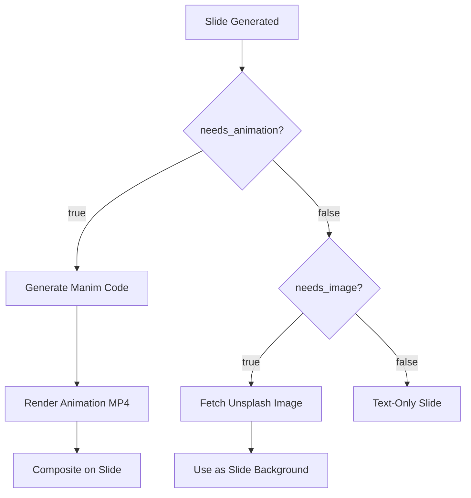

## Overview

The Visual Media system provides two distinct ways to add visuals to your presentation:

1. **Manim Animations**: AI-generated Python code that creates mathematical and educational animations using the Manim Community Edition library
2. **Unsplash Images**: High-quality, royalty-free photographs fetched from Unsplash's API based on keywords

These are **mutually exclusive** - each slide uses either an animation, an image, or neither (text-only).

## Manim Animations

### What is Manim?

Manim (Mathematical Animation Engine) is a Python library for creating precise programmatic animations, originally developed by 3Blue1Brown. This project uses **Manim Community Edition** to generate educational visualizations.

### When Animations Are Generated

Animations are only created when `needs_animation=true` in the content structure. The system:

1. **Generates Python Code**: Uses Gemini AI to write Manim code based on `animation_description`
2. **Validates Structure**: Ensures code contains required elements (`class SlideAnimation`, `def construct(self)`)
3. **Saves Script**: Writes Python file to `workspace/source/data/manim_code/`
4. **Renders Video**: Executes Manim to produce MP4 animation
5. **Composites onto Slide**: Places animation in the designated placeholder area

### Animation Code Generation

The `ManimGenerator` uses Gemini AI with strict guidelines:

```python
class ManimGenerator:
    def generate_animation_code(self, slide_data: Dict, duration: float) -> str:
        prompt = f"""Generate Manim animation code. Follow ALL rules to avoid errors.
        
        TASK:
        - Title: {slide_data['title']}
        - Animation: {slide_data['animation_description']}
        - Duration: {duration}s
        
        ⚠️ CRITICAL: Use only safe Manim objects (Circle, Square, Line, Text, etc.)
        Do NOT use CurvedPolyline, NumberLine, Axes, or other unsupported objects.
        
        OUTPUT: Only Python code. Class name = 'SlideAnimation'. No markdown.
        """
        
        response = self.model.generate_content(prompt)
        return self._validate_and_clean_code(response.text)
```

<Warning>
Animation generation follows a **MANIM_CODE_GUIDE.md** file that restricts which Manim objects can be used. This prevents rendering errors from unsupported features.
</Warning>

### Code Structure

All generated animations follow this template:

```python
from manim import *

class SlideAnimation(Scene):
    def construct(self):
        # Animation code here
        # Example: Pythagorean theorem visualization
        
        # Create right triangle
        triangle = Polygon(
            [0, 0, 0], [3, 0, 0], [3, 4, 0],
            color=BLUE
        )
        
        # Show triangle
        self.play(Create(triangle))
        self.wait(1)
        
        # Add squares on each side
        square_a = Square(side_length=3, color=RED)
        square_a.next_to(triangle, DOWN)
        
        self.play(Create(square_a))
        self.wait(2)
```

### Validation & Fallback

If code generation fails or produces invalid syntax, the system uses a fallback:

```python
def _get_fallback_animation(self, slide_data: Dict, duration: float) -> str:
    return f"""from manim import *

class SlideAnimation(Scene):
    def construct(self):
        # Simple fallback animation
        text = Text("{slide_data['title']}", font_size=40, color=BLUE)
        self.play(Write(text))
        self.wait({duration - 1})
        self.play(FadeOut(text))
"""
```

<Tip>
Check the generated Manim code files in `data/manim_code/` to debug animation issues. You can manually edit these files and re-render if needed.
</Tip>

### Animation Rendering

After code generation, Manim CLI renders the animation:

```bash
manim -qh --format=mp4 \
  --fps 30 \
  --resolution 1920x1080 \
  <script_path> SlideAnimation
```

**Render settings:**
- **Quality**: High (`-qh`) for production
- **Format**: MP4 (H.264 codec)
- **FPS**: 30 frames per second
- **Resolution**: 1920x1080 (Full HD)

### File Naming

Animation files use sanitized filenames:

```python
@staticmethod
def sanitize_filename(text: str, max_length: int = 20) -> str:
    text = text[:max_length]
    text = text.replace(' ', '_').replace(':', '').replace('/', '_')
    text = text.replace('"', '').replace("'", '').replace('?', '')
    return text

# Example: "What is Force?" → "What_is_Force_slide_2.py"
```

## Unsplash Images

### When Images Are Fetched

Images are downloaded when `needs_image=true` in the content structure. The system:

1. **Searches Unsplash**: Uses the `image_keyword` to query their API
2. **Selects Top Result**: Takes the first (most relevant) image
3. **Downloads Regular Size**: Fetches the "regular" resolution variant (~1080px width)
4. **Saves as JPG**: Stores locally for slide rendering

### Image Fetcher Implementation

```python
class ImageFetcher:
    def fetch_image(self, keyword: str, slide_number: int, topic: str) -> str:
        try:
            params = {
                "query": keyword,
                "per_page": 1,  # Only need the best match
                "client_id": self.api_key
            }
            
            response = requests.get(self.base_url, params=params)
            data = response.json()
            
            if response.ok and data.get('results'):
                image_url = data['results'][0]['urls']['regular']
                
                # Download image
                image_response = requests.get(image_url)
                if image_response.ok:
                    # Save to disk
                    image_path = Config.IMAGES_DIR / f"{topic}_slide_{slide_number}.jpg"
                    with open(image_path, 'wb') as f:
                        f.write(image_response.content)
                    
                    return str(image_path)
            
            return ""  # No image found
            
        except Exception as e:
            print(f"Error fetching image: {e}")
            return ""
```

### API Configuration

Unsplash requires an access key configured in your environment:

```python
class Config:
    UNSPLASH_ACCESS_KEY = os.getenv("UNSPLASH_ACCESS_KEY")
```

Get your key from [Unsplash Developers](https://unsplash.com/developers).

<Info>
Unsplash has a **50 requests per hour** rate limit on the free tier. For larger presentations, consider upgrading to a paid plan or caching images.
</Info>

### Image Selection Best Practices

**Good keywords:**
- "Albert Einstein portrait" (specific person)
- "DNA double helix structure" (specific object)
- "solar system planets" (concrete concept)
- "Taj Mahal architecture" (specific place)

**Poor keywords:**
- "science" (too broad)
- "learning" (abstract concept)
- "information" (non-visual)

<Tip>
The Content Generator (Gemini AI) is trained to create effective `image_keyword` values. Trust its suggestions unless you need manual override.
</Tip>

### Error Handling

If image fetch fails:
- **No results found**: Slide will render as text-only
- **Network error**: Exception is caught, empty string returned
- **Invalid API key**: Error printed to console

The system gracefully degrades to text-only slides rather than failing the entire generation.

## Visual Media Directories

### File Organization

```
workspace/source/data/
├── manim_code/          # Generated Python animation scripts
│   └── <topic>_slide_<num>.py
├── manim_videos/        # Rendered MP4 animations
│   └── <topic>_slide_<num>.mp4
└── images/              # Downloaded Unsplash images
    └── <topic>_slide_<num>.jpg
```

### File Paths

Paths are managed in `config.py`:

```python
class Config:
    BASE_DIR = Path(__file__).resolve().parent
    DATA_DIR = BASE_DIR / "data"
    
    MANIM_CODE_DIR = DATA_DIR / "manim_code"
    MANIM_VIDEO_DIR = DATA_DIR / "manim_videos"
    IMAGES_DIR = DATA_DIR / "images"
```

## Animation vs Image Decision Flow

Here's how the system decides which visual to use:



<Warning>
If both `needs_animation` and `needs_image` are accidentally set to `true`, the validation layer will raise an error. This is enforced at the content generation stage.
</Warning>

## Customization Options

### Manim Render Quality

Adjust quality in `config.py`:

```python
MANIM_QUALITY = "-qh"  # Options: -ql (low), -qm (medium), -qh (high), -qk (4K)
MANIM_FPS = 30         # Frames per second
MANIM_RESOLUTION = "1920x1080"  # Output resolution
```

### Unsplash Image Size

Modify the URL variant in `image_fetcher.py:27`:

```python
# Available sizes:
image_url = data['results'][0]['urls']['raw']      # Original (very large)
image_url = data['results'][0]['urls']['full']     # Full resolution
image_url = data['results'][0]['urls']['regular']  # ~1080px (default)
image_url = data['results'][0]['urls']['small']    # ~400px
image_url = data['results'][0]['urls']['thumb']    # ~200px
```

## Troubleshooting

### Manim Animations Not Rendering

**Symptom**: Animation code generates but MP4 file is missing

**Solutions:**
- Verify Manim is installed: `manim --version`
- Check `MANIM_CODE_GUIDE.md` for restricted objects
- Review Manim logs in console output
- Test animation manually: `manim -pql <script.py> SlideAnimation`

### Unsplash Images Not Downloading

**Symptom**: Empty image path returned

**Solutions:**
- Verify `UNSPLASH_ACCESS_KEY` environment variable
- Check rate limit (max 50 requests/hour)
- Test keyword in Unsplash web search
- Inspect console for API error messages

### Animation Quality Issues

**Symptom**: Animations look pixelated or blurry

**Solutions:**
- Increase render quality: `MANIM_QUALITY = "-qk"` (4K)
- Ensure source resolution matches output (1920x1080)
- Check font sizes in generated code (should be 24-48pt)

## Performance Considerations

- **Animation Rendering**: Can take 10-60 seconds per animation depending on complexity
- **Image Download**: Typically less than 2 seconds per image
- **Disk Usage**: Animations are 1-5 MB each, images are 200-800 KB each

<Tip>
For faster iteration, use `-ql` (low quality) during development and switch to `-qh` (high quality) for final rendering.
</Tip>

## Related Features

- [Content Generation](/features/content-generation) - Decides when to use animations vs images
- [Video Composition](/features/video-composition) - Integrates visual media into final video timeline